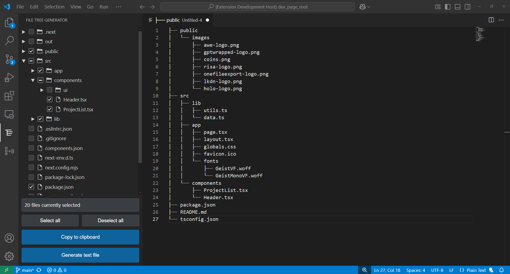

# File Tree Export - README

**File Tree Export** is a simple yet powerful VSCode extension that allows you to **generate an ASCII file tree** from your selected files and folders in your workspace. Instead of merging file contents into one long text block, the extension produces a clean, hierarchical diagram that clearly shows your project's structure in a format optimized for AI ingestion and easy sharing.

## Features

- **Select Files & Folders:** Choose multiple files and folders from your workspace.
- **Generate ASCII File Tree:** Create a clear, textual representation of your file hierarchy (e.g., using symbols like `├──`, `└──`, and `│`).
- **Copy to Clipboard:** Easily copy the generated file tree for use in documentation or other applications.
- **Generate Text File:** Open a new text document containing the ASCII file tree for further editing or export.
- **Optimized for AI:** The simple and unambiguous structure makes it ideal for parsing by AI systems.

## Requirements

No additional dependencies are required. Just install the extension and start generating file trees immediately.

## Extension Settings

This extension does not introduce new settings.

## Known Issues

- Large projects with many files might take longer to generate the file tree.
- The ASCII diagram focuses solely on file and folder names; it does not include file contents or metadata.

## Release Notes

### 0.0.1

- **Enhanced UI:** Simplified interface for selecting files/folders and generating the file tree.
- **Export Options:** Now supports copying the file tree to the clipboard and generating a new text file with the diagram.

---

## For More Information

Enjoy using **File Tree Export** and streamline the way you view and share your workspace structure! 🚀
